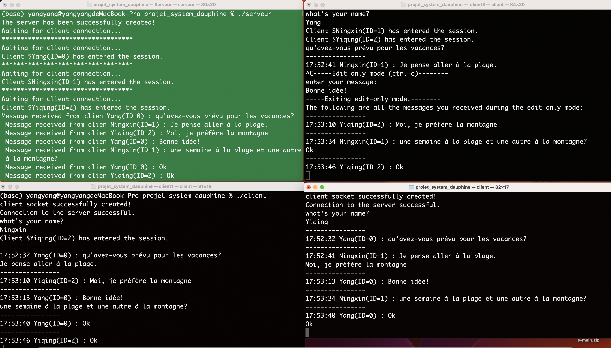

# **messagerie instantanée** *（Serveur de chat multi-clients en C）*

## **Presentation**

Ce logiciel offre une simulation de salon de discussion de groupe. Tous les clients ont leur propre profil, composé d'un identifiant unique et d'un nom individuel. Ce nom est déterminé par le premier message que chaque utilisateur envoie au serveur après avoir établi une connexion. Lorsque l'on quitte le serveur en utilisant ctrl +c, les messages envoyés par les clients qui sont encore en ligne à ce moment-là sont enregistrés dans un fichier nommé messages.txt.

## **Utilisation**

### **1.Compilation**
Compilation du serveur
```
gcc serveur.c -pthread -o serveur
```
Compilation du client
``` 
gcc client.c -pthread -o client
```
### **2.Execution**
Exécution du serveur
```
./serveur

```
Exécution d'un client
```
./client
```

### **3.Commande pour quitter le programme（important)**
### Quitter le client : `quit` 
### Quitter le serveur : `ctrl + c`
### Le client passe en mode édit_only[^6] : `ctrl+c`
Nous recommandons d'utiliser 'ctrl+c' directement sur le serveur, tous les clients se fermeront automatiquement. [^2]. 

## Attention
[^1].*Sur un même appareil informatique, il est possible d'avoir plusieurs terminaux ouverts. Un terminal exécute le code du serveur, tandis que d'autres terminaux peuvent exécuter le code du client. Le rôle du serveur est de traiter les messages envoyés par les clients. Par conséquent, veuillez ne pas entrer d'informations sur le terminal du serveur, mais plutôt sur ceux des clients.*

[^2]*En ce qui concerne la fermeture du programme, notre recommandation est de taper 'ctrl+c' directement dans le serveur, et tous les clients se fermeront automatiquement. L'avantage de cette approche est que tous les messages envoyés par les utilisateurs sont enregistrés dans le fichier messages.txt. Il est bien sûr possible de fermer un seul client en tapant 'quit' dans ce dernier, mais les messages du client qui se déconnecte prématurément ne seront pas enregistrés dans le fichier messages.txt.*

[^3]*Pour tester le code sans interférence due à l'instabilité du réseau, nous utilisons des sockets Unix, de sorte que la communication entre le client et le serveur ne peut s'effectuer que sur un seul appareil. Il n'est donc pas possible d'exécuter notre code sur plusieurs appareils.*

[^4]*Il est recommandé d'exécuter d'abord `./serveur`, puis d'exécuter `./client`, sinon la connexion client échouera facilement.*

[^5]*Si vous ouvrez accidentellement deux serveurs en même temps, veuillez vous déconnecter des deux serveurs, puis vous connecter à un nouveau serveur.*

[^6]*Mode edit_only : Les messages envoyés par d'autres clients ne sont pas affichés lorsque le client est en mode edit_only (pour répondre aux exigences de l'étape 7 du thème du projet).*

*Entrer en mode edit_only : `ctrl+c`*

*Sortir du mode edit_only : `envoyez un message`*

[^7]*Le serveur accepte jusqu'à NUM_MAX clients en même temps.Dans notre programme, ce nombre est 10 dans notre programme.*

[^8]*Merci de ne pas envoyer plus de 100 caractères dans un seul message. 100 est la longueur maximale des messages acceptée, telle que nous l'avons définie dans le programme.*

[^9]*./serveur et ./client doivent être exécutés dans des terminaux différents, mais tous les terminaux se trouvent dans le même répertoire.*

[^10]*Le code contient des commentaires très détaillés pour vous aider en cas de difficultés à le compiler ou à l'utiliser.*

## Capture d'écran du programme en cours de fonctionnement
Le terminal en haut à gauche exécute le serveur


## Contact
Si vous avez des questions, veuillez contacter:

Yang YANG(yang.yang2@dauphine.eu)

Ningxin YE(ningxin.ye@dauphine.eu)

Yiqing CHEN(yiqing.chen@dauphine.eu)
